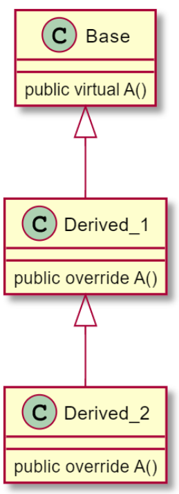

# Lab 11 Exercise 4

## Virtual member inheritance


1.สร้าง console application project

```cmd
dotnet new console --name Lab11_Ex04
```

2.เปลี่ยน code ให้เป็นดังต่อไปนี้

```cs
var b = new Base();
var d1 = new Derived_1();
var d2 = new Derived_2();

b.A();
d1.A();
d2.A();

class Base
{
    public virtual void A()
    {
        System.Console.WriteLine("Base.A()");
    }
}
class Derived_1 : Base
{
    public override void A()
    {
        System.Console.WriteLine("Derived_1.A()");
    }
}
class Derived_2 : Derived_1
{
    public override void A()
    {
        System.Console.WriteLine("Derived_2.A()");
    }
}
```

3.Build project โดยการใช้คำสั่ง

```cmd
dotnet build  Lab11_Ex04
```

ถ้ามีที่ผิดพลาดในโปรแกรม ให้แก้ไขให้ถูกต้อง

4.บันทึกผลที่ได้จากการรันคำสั่งในข้อ 3

5.Run project โดยการใช้คำสั่ง

```cmd
dotnet run --project Lab11_Ex04
```

6.บันทึกผลที่ได้จากการรันคำสั่งในข้อ 5

7.อธิบายสิ่งที่พบในการทดลอง
